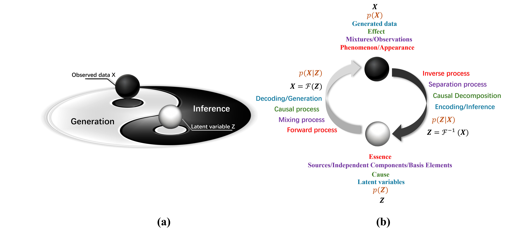

Generative Models Enable True Understanding-The Link Between Interpretability and Generative Ability

Yuan-Hao Wei
HKPU
Yuan-Hao.Wei@outlook.com

Abstract
Interpretability and generative capability in generative models are fundamentally two complementary aspects. A highly interpretable model typically learns the true underlying generative mechanisms behind data, such as physical laws, causal relationships, or explicit structures. As these mechanisms are inherently stable and universally applicable, such models can reliably generalize beyond training data, producing more reasonable and robust samples with fewer generation failures. In addition, a highly controllable and powerful generative model implicitly or explicitly captures genuine and effective underlying rules. The ultimate goal of training generative models should extend beyond obtaining high-quality samples to exploring and understanding the underlying generative mechanisms of phenomena. When a generative model demonstrates controllability and scalability with respect to a dataset, it indicates the model has genuinely learned the mechanisms that generate the data. This opens up a paradigm in scientific research, enabling the discovery of underlying principles through observational data reconstructed by generative models, particularly when these models exhibit controllability and scalability. Leveraging powerful nonlinear mapping, efficient iterative training, and structured interpretability, artificial intelligence holds the potential to uncover and understand rules and principles currently beyond human knowledge.

	Introduction
Current mainstream artificial intelligence models, particularly those used for classification tasks in supervised learning, rely heavily on large-scale parameters, vast amounts of data, and extensive computational resources. Essentially, these models achieve their objectives through data-driven statistical fitting rather than genuinely understanding the intrinsic structures and causal relationships within the data. While this approach performs exceptionally well on large datasets, it is fundamentally a "black-box" form of function approximation, rather than a human-like learning and reasoning process.
Typically, phenomena directly observable by humans are referred to as "manifestations," and the human learning process essentially involves inferring underlying rules from these observable manifestations. Once humans grasp these underlying rules, they become capable of reproducing the manifestations intentionally. For instance, after understanding the physical principles behind fire and lightning, humans learned to deliberately create fire and generate electricity. Analogously, generative models should focus on two primary tasks:
	Inferring underlying rules from manifestations ("inverse reasoning");
	Generating manifestations based on these underlying rules ("generation").
For artificial intelligence to truly achieve "intelligence," it should aim to learn clear structural relationships embedded within data, rather than merely performing statistical fitting. Structured modeling, disentangled representation learning, and causal inference are crucial steps towards genuine understanding in artificial intelligence. Only when a generative model can identify the causal structure underlying the data and leverage this structure to produce plausible samples can it be considered a truly interpretable and transparent system.
1.1 Interpretability of Generative Models
The goal of a generative model extends beyond merely producing samples that approximate a target distribution—it should also uncover and represent the underlying mechanisms governing that distribution, thereby enhancing its interpretability. Greater interpretability indicates a deeper understanding of the target distribution by the model. When a generative model explicitly characterizes these internal mechanisms, it transitions from being an uninterpretable "black-box" into a system capable of reasoning and generalizing underlying principles.
In other words, the generative capability and interpretability of a model should evolve in tandem. Enhanced interpretability implies that the generative model genuinely grasps the principles driving the target distribution, and this deeper comprehension, in turn, improves the realism and plausibility of the generated samples.
1.2 Structured Modeling of Latent Variables
Early generative models, such as vanilla Variational Autoencoders (VAEs) (Kingma and Welling (2013)) and Generative Adversarial Networks (GANs) (Goodfellow et al., (2020)), introduced the concept of latent variables—assuming that the observed characteristics of the target data X_data are controlled by a set of hidden factors. However, these models typically assume the latent variables follow a standard normal distribution. While this assumption simplifies derivations and sampling procedures, it neglects structured relationships among latent variables and does not promote their disentanglement. Consequently:
	Latent variables are not effectively disentangled, causing dimensions to become entangled and lack independence.
	The assumed distribution of latent variables may not reflect the true generative mechanisms underlying the observed data, thus limiting the model's interpretability.
	Samples generated by VAEs often appear blurry, and latent projections into lower-dimensional spaces lack clear patterns.
To address these issues, an ideal generative model should incorporate structured latent variables, characterized by:
	Clear interpretability: Each latent variable dimension z={z_1,z_2,…,z_N} explicitly controls a distinct and interpretable feature of the target distribution.
	Independence among latent dimensions: Each dimension is maximally independent, ensuring minimal interference among different factors.
	Transparent and controllable mapping: The process mapping latent variables to observed data should be clear and manipulable, allowing the generation of samples that vary systematically according to specific latent dimensions.
When a generative model successfully captures these independent causal factors {z_1,z_2,…,z_N} and their corresponding mappings to observed data, it genuinely understands the generative mechanisms of the target distribution. Such structured latent-variable modeling transforms generative models from mere black-box data fitters into transparent systems capable of understanding, generalizing, and reasoning about causal relationships.

	Exploration of Interpretability in Generative Models
2.1 Independent Component Analysis
Independent Component Analysis (ICA) is generally recognized as an inverse method for separating mixed signals. Real-world signals are often mixtures originating from multiple independent sources. Each source can be viewed as an independent component. Understanding the observed mixed signals involves identifying how underlying factors influence them and reconstructing these independent components through inverse process.
From a traditional viewpoint, ICA belongs to signal processing and seems unrelated to generative models. However, adopting a broader perspective, observed mixed signals can be considered as being "generated" by independent sources through a mixing process. Each independent source can thus be represented by structured latent variables. In this way, ICA can broadly be seen as a problem solvable by interpretable generative models. The inference process (mapping observed signals x_data to sources z.) represents an inverse operation, whereas the generative process corresponds to remixing from latent sources z back to x_data.
The iVAE framework proposed by Khemakhem et al. (2020) represents a fusion of ICA theory with generative modeling methods. Their work demonstrates identifiability conditions for latent variables in a conditional VAE framework with auxiliary variables, laying a foundation for deep representation learning and disentanglement. Additionally, an earlier attempt by Brakel and Bengio (2017) applied GAN to ICA by introducing discriminators to test latent variable independence, successfully separating independent components in both linear and nonlinear contexts.
2.2 Disentanglement
Disentangled representation typically refers to a latent representation where each dimension independently captures a single underlying generative factor of the data, ensuring independence and non-overlapping among latent variables (Kumar et al., 2017). Intuitively, in a disentangled representation, altering a specific latent factor should only affect the corresponding attribute of the generated data, leaving other attributes unchanged (Locatello et al., 2019). In short, disentanglement aims to establish a clear "one-to-one correspondence" between dimensions of the latent representation and different generative factors, thereby enhancing interpretability and controllability in generative models.
The β-VAE method proposed by Higgins et al. (2017) enhances factor disentanglement by assigning greater weight to the KL divergence term in the VAE loss function. This approach achieved superior results compared to earlier methods such as InfoGAN (Chen et al., 2016). Subsequently, FactorVAE (Kim & Mnih, 2018) improved disentanglement further by explicitly penalizing total correlation (TC) among latent variables. By integrating TC as a regularization term in the training objective, FactorVAE explicitly discourages statistical dependence between latent variables. Building upon this research, Chen et al. (2018) introduced β-TCVAE, essentially refining β-VAE by strengthening constraints on independence.
Beyond the β-VAE framework, Kumar et al. (2017) developed the Disentangled Inferred Prior VAE (DIP-VAE) framework, with DIP-VAE-I and DIP-VAE-II representing distinct implementation modes. Fundamentally, DIP-VAE introduces regularization terms that encourage independence among latent variable dimensions.
Compared to ICA, disentanglement tasks typically handle more complex information with higher dimensionality, stronger nonlinearity, and more abstract data structures, making them inherently more challenging. To some extent, disentanglement can be regarded as a generalized form of "nonlinear ICA."
2.3 Causal Inference
Ideally, natural causal processes are expected to be decomposed into mutually independent modules, each corresponding to factors generating or influencing other factors. Generative models endowed with causal structures enable controlled generation of samples by manipulating causal factors within the model, ensuring the learned representations align with real causal factors underlying the data (Yang et al., 2021). Introducing causal structures into latent spaces of generative models is not merely a technical method but rather an attempt to closely approximate and dissect the real-world mechanisms. In reality, various properties of physical samples inherently arise from multiple independent causal factors. Although current scientific capabilities may limit our comprehensive understanding of all details, causal generative models offer closer approximations to underlying natural laws.
CausalVAE exemplifies the integration of causal representation and generative models. It introduces a causal layer into the VAE framework to impose a causal graphical structure. Remarkably, CausalVAE can perform interventions based on learned causal representations—for instance, identifying "lighting" as a cause and "shadow" as an effect enables generation of shadow-free images, even if such images were absent from the training set. This indicates that the generative model truly comprehends causal mechanisms, thus allowing generation aligned with objective laws and extending beyond the training data. Another significant development, SCM-VAE (Komanduri et al., 2022), explicitly incorporates known causal structures as priors into the VAE. With stronger structural priors, SCM-VAE achieves identifiable causal representations with moderate supervision and excels at interventional reasoning tasks. Empirical validations demonstrated that SCM-VAE, guided by fixed causal graphs (e.g., "smile" influencing "mouth shape"), can generate realistic human faces with specific smile intensities while accurately reflecting underlying causal relationships.
Beyond VAEs, Generative Adversarial Networks (GANs) have also been applied to causal modeling. Kocaoglu et al. (2017) proposed a conditional GAN architecture trained according to given causal graphs, treating causal factors as labels. Their design enabled the GAN generator to produce samples following explicit causal chains.

	Inference-Generation Closed Loop
In practice, true artificial intelligence should possess logical reasoning capabilities. If a machine learning model fails to comprehend the underlying mechanisms and reasons controlling the properties of target x_data, its generated samples will lack traceability and rationality. However, if the model successfully disentangles the various factors behind x_data, it genuinely grasps natural laws or physical principles, demonstrating clear and effective logical reasoning skills. At this stage, the model truly understands and deconstructs the target x_data, achieving genuine learning and inference capabilities. Consequently, its generative capabilities experience substantial improvements, as the generated samples inherently align with objective rules and natural laws. Thus, interpretability and generative ability exhibit a balanced and strongly correlated relationship—the better a generative model's interpretability, the more accurately it captures underlying principles, and the more naturally its samples align with real-world phenomena.
Natural phenomena observed in reality can be denoted by x_data, while the underlying causes can be represented as z. Typically, observed phenomena reflect a forward process from z to x_data. Conversely, inferring the underlying essence (latent variables z) from observed phenomena (x_data) constitutes an inverse process (relative to the forward generative process), typically described as inference or posterior estimation p(〖z|x〗_data ) (determining z given x_data). Ideally, when training a generative model, inference and generation capabilities should improve synchronously, forming a mutually reinforcing "inference-generation closed loop," as illustrated in Figure 1(a). The traditional Chinese concept of Yin and Yang (Tai Chi) metaphorically captures this relationship, symbolizing complementary, mutually transforming, and unified dualities. Figure 1 (b) further illustrates various specific tasks encompassed within a generalized inference-generation closed loop, including inverse problems, ICA, causal inference, decoupling, disentanglement, counterfactual generation, and Bayesian inference. These tasks share a common trait: observable phenomena are governed by latent, unobservable factors. By reversing phenomena to infer these latent factors, one discovers underlying rules, ultimately enabling a more accurate generation of phenomena. Hence, ideal generative models exhibit a symbiotic balance between interpretability and generative capabilities (interpretability-generation equilibrium), as depicted in Figure 2.

 
Figure 2.  Interpretability-Generation Equilibrium

In a previous tutorial (Wei, 2025), the limitations of classical generative models (e.g., VAE and GAN) were briefly discussed. These models typically rely on simple priors and lack structured, factorized, or independent constraints, resulting in uncontrollable, black-box generation processes. Consequently, VAEs and GANs essentially function as high-dimensional distribution approximators driven by the nonlinear mapping capabilities of neural networks. Figure 3(a) depicts the classical generative model mechanism, illustrating its reliance on simple distributions and black-box mappings to approximate complex high-dimensional distributions, inherently limiting interpretability. In contrast, Figure 3(b) demonstrates the structured generative model approach, analogous to constructing a building from basic modular elements. This method ensures both high-quality generation and explicit inference of underlying principles and rules.

 
Figure 3.  Interpretable Generative Models vs. Black Box Generative Models

	Discussion and Prospects
4.1 Probabilistic Models and Prior Settings
It is essential to recognize that observed information in practical scenarios is inevitably subject to various limitations and interferences. Moreover, the mechanisms underlying many phenomena are inherently probabilistic rather than deterministic. Consequently, the correspondence from essence to phenomena is often probabilistic rather than strictly one-to-one. Fortunately, current generative models are fundamentally built upon probabilistic theory.
Probabilistic models, particularly those based on Bayesian theory, allow known rules or principles to serve as priors within structured generative models. Such priors significantly influence neural network architecture design and facilitate efficient training. For instance, if a known mapping relationship explicitly excludes convolution processes, neural network designs need not incorporate convolutional or deconvolutional layers.
4.2 Evaluating Mapping Reasonability via Generation Controllability
Owing to the inference-generation loop and the interpretability-generation equilibrium, even in domains lacking sufficient prior knowledge, the reasonableness of proposed structures and mappings can be assessed solely by observing the controllability and extensibility of generated samples. By adjusting and optimizing neural network architectures iteratively, researchers can progressively identify optimal (e.g., sparsest) mapping rules, thereby uncovering underlying scientific principles. Thus, generative models have the potential to significantly accelerate the exploration and discovery of natural laws.

References
Brakel, P., & Bengio, Y. (2017). Learning independent features with adversarial nets for non-linear ica. arXiv preprint arXiv:1710.05050.

Chen, R. T., Li, X., Grosse, R. B., & Duvenaud, D. K. (2018). Isolating sources of disentanglement in variational autoencoders. Advances in neural information processing systems, 31.

Chen, X., Duan, Y., Houthooft, R., Schulman, J., Sutskever, I., & Abbeel, P. (2016). Infogan: Interpretable representation learning by information maximizing generative adversarial nets. Advances in neural information processing systems, 29.

Goodfellow, I., Pouget-Abadie, J., Mirza, M., Xu, B., Warde-Farley, D., Ozair, S., ... & Bengio, Y. (2020). Generative adversarial networks. Communications of the ACM, 63(11), 139-144.

Higgins, I., Matthey, L., Pal, A., Burgess, C., Glorot, X., Botvinick, M., ... & Lerchner, A. (2017, February). beta-vae: Learning basic visual concepts with a constrained variational framework. In International conference on learning representations.

Khemakhem, I., Kingma, D., Monti, R., & Hyvarinen, A. (2020, June). Variational autoencoders and nonlinear ica: A unifying framework. In International conference on artificial intelligence and statistics (pp. 2207-2217). PMLR.

Kim, H., & Mnih, A. (2018, July). Disentangling by factorising. In International conference on machine learning (pp. 2649-2658). PMLR.

Kingma, D. P., & Welling, M. (2013, December). Auto-encoding variational bayes.

Kocaoglu, M., Snyder, C., Dimakis, A. G., & Vishwanath, S. (2017). Causalgan: Learning causal implicit generative models with adversarial training. arXiv preprint arXiv:1709.02023.

Komanduri, A., Wu, Y., Huang, W., Chen, F., & Wu, X. (2022, December). Scm-vae: Learning identifiable causal representations via structural knowledge. In 2022 IEEE International Conference on Big Data (Big Data) (pp. 1014-1023). IEEE.

Kumar, A., Sattigeri, P., & Balakrishnan, A. (2017). Variational inference of disentangled latent concepts from unlabeled observations. arXiv preprint arXiv:1711.00848.

Kumar, A., Sattigeri, P., & Balakrishnan, A. (2017). Variational inference of disentangled latent concepts from unlabeled observations. arXiv preprint arXiv:1711.00848.

Locatello, F., Bauer, S., Lucic, M., Raetsch, G., Gelly, S., Schölkopf, B., & Bachem, O. (2019, May). Challenging common assumptions in the unsupervised learning of disentangled representations. In international conference on machine learning (pp. 4114-4124). PMLR.

Wei, Y. H. (2025). VAEs and GANs: Implicitly Approximating Complex Distributions with Simple Base Distributions and Deep Neural Networks--Principles, Necessity, and Limitations. arXiv preprint arXiv:2503.01898.

Yang, M., Liu, F., Chen, Z., Shen, X., Hao, J., & Wang, J. (2021). Causalvae: Disentangled representation learning via neural structural causal models. In Proceedings of the IEEE/CVF conference on computer vision and pattern recognition (pp. 9593-9602).

